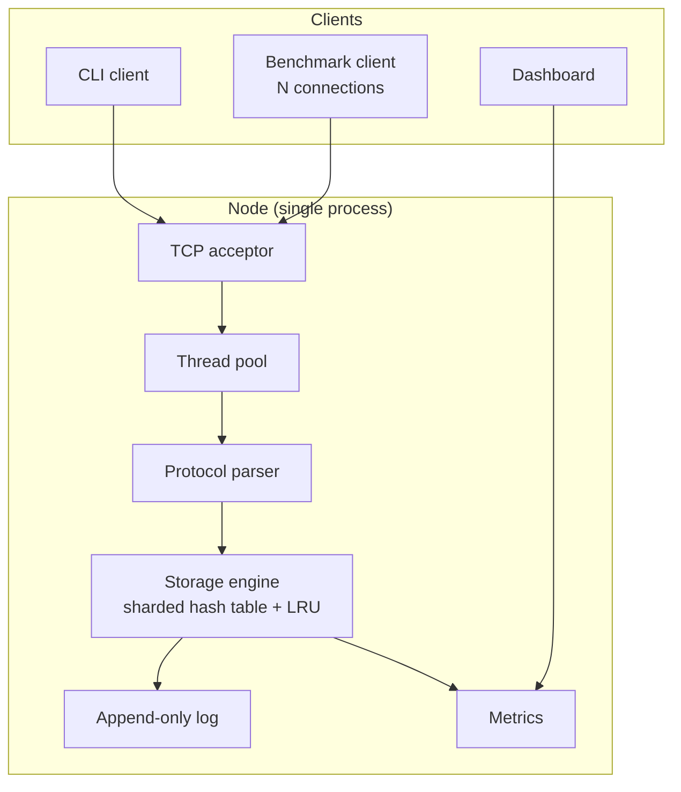
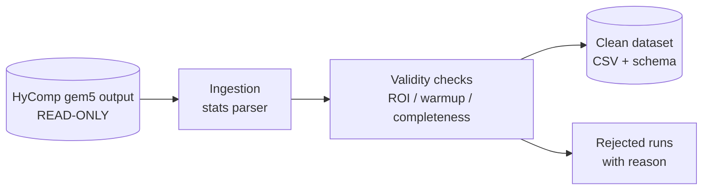
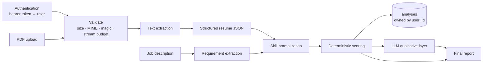
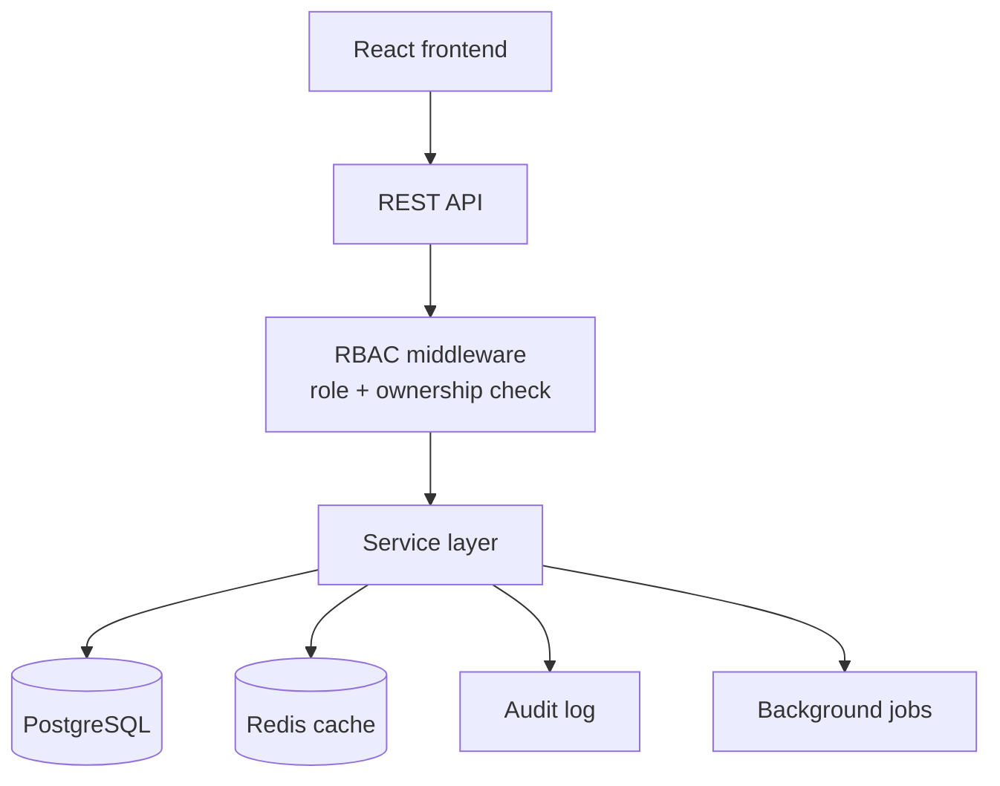

# Master Architecture

> **Design document, written at the start of the project and corrected on
> 2026-09-29.** It records the plan and the reasoning behind it. Where it once
> disagreed with what was actually built, the statement has been corrected here,
> and each project's own README is the authority on what it does. In particular:
> SwiftKV is **single-node** (no cluster, no replication); CacheLab has **no
> dashboard** and makes **no STT-RAM claim**; SmartLab predicts **GPU kernel
> runtime**, not cache performance. The five projects now live in separate
> repositories (see [README.md](README.md)).

How the five projects fit together, what each one proves, and why each was
designed the way it was.

Written to be readable by someone who has not built distributed systems before.
Where a term is used for the first time, it is explained.

---

## 1. Why five projects, and why these five

A placement portfolio has one job: prove you can build real systems, not follow
tutorials. Five projects were chosen so that together they cover the full
stack of a computer science degree without repeating the same skill twice.

| Project              | The one question it answers                               | Primary domain                |
| -------------------- | --------------------------------------------------------- | ----------------------------- |
| **SwiftKV**    | "Can you write systems code — sockets, threads, memory?" | C++ / Systems / Performance   |
| **CacheLab**   | "Can you do real research and report it honestly?"        | Computer Architecture / gem5  |
| **ResumeLens** | "Can you build an AI product that isn't just a prompt?"   | Full-stack / AI engineering   |
| **SmartLab**   | "Do you understand ML, or just`model.fit()`?"           | ML / Data science             |
| **CampusFlow** | "Can you build the boring production system correctly?"   | Full-stack / Security / Scale |

Deliberately, there is **no overlap in the hard part**. SwiftKV's hard part is
concurrency. CacheLab's is experimental validity. ResumeLens's is pipeline
design. SmartLab's is small-data honesty. CampusFlow's is authorization.

---

## 2. Portfolio-level layout

The five projects and the site that presents them are **six separate
repositories** under one GitHub account. They were developed side by side in a
single working tree, which is why some documents still say "the portfolio".

| Repository | What it is |
|---|---|
| `swiftkv` | C++20 single-node key-value store |
| `cachelab` | gem5 cache-compression analysis pipeline |
| `resumelens` | resume-to-job matching platform |
| `smartlab` | GPU kernel runtime prediction |
| `campusflow` | campus management platform |
| `placement-portfolio` | the portfolio site, and these cross-project documents in `docs/` |

Each project repository is **self-contained**: its own README, tests and
documentation. `resumelens` and `campusflow` each carry their own copy of the
`tools/` scripts that install and run PostgreSQL and Redis. `smartlab` reads
`cachelab`'s dataset from a sibling checkout for one optional command.

---

## 3. The environment this is built on

Before any architecture decision, the real machine was inspected. The
constraints below are not hypothetical — they were measured on 2026-08-25 and
they genuinely shaped the design.

| Resource           | Reality                                                               |
| ------------------ | --------------------------------------------------------------------- |
| CPU                | 512 logical cores (AMD EPYC 9754)                                     |
| RAM                | 503 GB                                                                |
| Disk`/data`      | 5.5 TB free ✅                                                        |
| Disk`/` (root)   | **8.6 GB free — 98% full** ⚠️                                |
| Docker             | **Installed but unusable** — no group membership, no sudo ⚠️ |
| PostgreSQL / Redis | Not installed system-wide, no root to install ⚠️                    |
| Currently running  | 20 gem5 simulation jobs (live research) ⚠️                          |

### What that forced

**a) Everything lives on `/data`, nothing on `/`.**
Node, Python and conda all default to writing into `$HOME`, which is on the
98%-full root disk. Filling it would take the machine down — including the
running research. So every cache and environment is redirected to `/data`.

**b) Docker is written but not run.**
Docker configuration is a required deliverable and it will be written properly.
But without daemon access it cannot be built or executed here, so it is marked
`[!]` in PROJECT_STATUS and **never described as tested**. Claiming a verified
Docker build would be exactly the kind of fabrication this portfolio forbids.

**c) Real Postgres and Redis, without root or Docker.**

> **What is PostgreSQL?** A relational database — it stores data in tables with
> strict rules, and guarantees that either a whole change happens or none of it
> does. **What is Redis?** An in-memory store used as a cache — far faster than
> a database, but the data lives in RAM, so it is used for things you can afford
> to lose and re-compute.

Both are available as **conda-forge packages**, which install into a user
directory and need no root at all. PostgreSQL 18 and Redis 8 are installed into
a conda environment on `/data`. These are the genuine servers, not stubs — so
"tested against PostgreSQL" is an honest claim.

**d) CacheLab treats the existing research as read-only.**
A 128-job gem5 sweep is running right now, and days of compute are already
invested. CacheLab reads its outputs. It never writes into that tree, never
re-runs it, and never kills a job.

**e) Load-testing tools are userspace-only.**
k6 is distributed as one static binary — download, `chmod +x`, done, no root.
That covers the HTTP projects. SwiftKV needs something different (see §4).

---

## 4. Cross-cutting engineering decisions

### 4.1 Why SwiftKV gets a custom benchmark client

k6, wrk, ApacheBench and Locust all speak **HTTP**. SwiftKV speaks its own
binary TCP protocol. No off-the-shelf tool can drive it. So SwiftKV ships a
purpose-built C++ benchmark client that opens N concurrent connections, issues a
configurable read/write mix, and records per-operation latency.

This is not a workaround — it is the correct choice, and it is also how real
systems do it (`redis-benchmark` exists for exactly this reason). It also means
the latency numbers are measured at the client, including network time, which
is the number that actually matters.

### 4.2 Latency is reported as percentiles, never as an average

An average hides the worst experience. If 99 requests take 1 ms and one takes
2 seconds, the average looks like 21 ms and nobody notices the disaster.

Every performance report in this portfolio gives **P50, P95, P99** alongside
throughput and error rate.

> **P95 = 95th percentile.** Sort every request by how long it took; the P95 is
> the time that 95% of requests came in under. It describes the slow tail that
> real users actually complain about.

### 4.3 Deterministic logic is separated from AI output

In ResumeLens, the match score is computed by ordinary code with rules you can
read and re-run — the same input always gives the same score. The language
model is used only for *qualitative* commentary on top.

This matters because an LLM cannot be trusted to produce a stable number, and a
score that changes between runs is not a score. The UI labels the two sources
separately so a user always knows which is which.

### 4.4 Predictions are never presented as measurements

SmartLab outputs **Predicted** kernel runtime. CacheLab reports **Simulated** IPC from
gem5. These are labelled differently everywhere they appear — in the API
response, in the UI, and in the docs. Blurring them would be the single most
dishonest thing this portfolio could do.

### 4.5 Security posture

No project claims to be secure. Each one documents:

> Threat → Risk → Mitigation → Test

If a mitigation has no test behind it, it is listed as untested. The threat
models follow OWASP categories and are written per project, because the threats
genuinely differ — SwiftKV's attacker sends malformed packets, ResumeLens's
uploads a malicious PDF, CampusFlow's is a logged-in student trying to read
another student's grades.

---

## 5. Per-project architecture summaries

Full detail lives in each project's own `ARCHITECTURE.md`. These are the
one-page versions.

### 5.1 SwiftKV



**Key decision — sharded locking.** One global mutex around the hash table
would serialize every client and destroy throughput on a 512-core machine. The
table is split into N independent shards, each with its own lock, so operations
on different keys proceed in parallel.

> **What is a mutex?** A lock that lets only one thread touch shared data at a
> time. It prevents corruption, but it also creates a queue — so the design goal
> is to hold locks briefly and to have many of them rather than one big one.

**Key decision — append-only log for persistence.** Every write is appended to
a file before being acknowledged. Appending is sequential, which is fast; on
restart the log is replayed to rebuild state. This is how Redis AOF works.

### 5.2 CacheLab



The **validity stage is the whole point**. A gem5 run can complete successfully
and still be scientifically meaningless — if the ROI never triggered, if warmup
was too short, or if the instruction counts don't match across schemes being
compared. CacheLab classifies every run and publishes the rejects with reasons,
rather than quietly dropping them.

### 5.3 ResumeLens



Note that `SCORE` feeds the report **directly** as well as through the LLM. If
the LLM is unavailable or the API key is missing, the deterministic half of the
report still works. The system degrades; it does not fail.

**Key decision — ownership lives in the SQL.** Resumes are personal data, so
the worst outcome this system can produce is showing one person's resume to
another. Every query touching a user-owned row carries `user_id` in its `WHERE`
clause, so a row belonging to someone else is never loaded at all. The
alternative — fetch the row, then compare its owner — is one forgotten `if`
away from a breach.

**Key decision — the score is stored before the model is called.** That single
ordering is what makes prompt injection structurally unable to move the number:
by the time a language model could be influenced by a hostile job description,
the score is already durable. A test sends a real injection payload to a model
that fully complies with it and asserts the score is unchanged.

### 5.4 SmartLab

Input: the 14 tuning parameters of an OpenCL SGEMM kernel. Output: predicted
runtime, with a typical-error band that is the model's *global* test error, not
a per-prediction interval.

The dataset is the UCI SGEMM GPU kernel performance dataset, 241,600 measured
configurations. SmartLab was first planned as a small-data problem trained on
CacheLab's gem5 results; that proved unworkable, since the usable gem5 data is
72 rows and its apparent accuracy is an artefact of workload identity. Those 72
rows are kept only as a counterexample.

### 5.5 CampusFlow



**Key decision — authorization is checked at the service layer, not the UI.**
Hiding a button does not stop anyone; the API is what must refuse. Every
endpoint that touches a specific record checks both *role* ("are you faculty?")
and *ownership* ("is this your course?"), and there are tests that log in as one
user and attempt to read another's data expecting a refusal (a 404, so the API does not
confirm that the record exists).

---

## 6. What "done" means here

A module is done when all seven of these exist:

```
Requirement → Design → Implementation → Unit test → Integration test
            → Security check → Performance check → Documentation
```

Not when the code runs. `PROJECT_STATUS.md` is the ledger, and a box is only
ticked after the command was actually executed and its output recorded.
